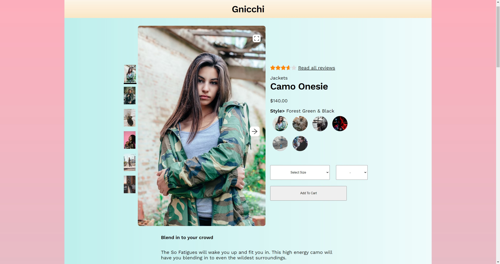

<a name="readme-top"></a>

<div align="center">
  <a href="https://github.com/Nugget-Reactor/FEC">
    
  </a>
<h3 align="center">Gnicchi</h3>
  <p align="center">
    Gnicchi is a mock front-end webstore created for our Hack Reactor Front End Capstone Project.
    <br />
    <br />
    <a href="https://github.com/Nugget-Reactor/FEC/issues">Report Bug</a>
    ·
    <a href="https://github.com/Nugget-Reactor/FEC/issues">Request Feature</a>
  </p>
</div>

<!-- TABLE OF CONTENTS -->
<details>
  <summary>Table of Contents</summary>
  <ol>
    <li>
      <a href="#about-the-project">About The Project</a>
      <ul>
        <li><a href="#built-with">Built With</a></li>
      </ul>
    </li>
    <li>
      <a href="#getting-started">Getting Started</a>
      <ul>
        <li><a href="#prerequisites">Prerequisites</a></li>
        <li><a href="#installation">Installation</a></li>
      </ul>
    </li>
    <li><a href="#usage">Usage</a></li>
    <li><a href="#roadmap">Roadmap</a></li>
    <li><a href="#contributing">Contributing</a></li>
    <li><a href="#license">License</a></li>
    <li><a href="#contact">Contact</a></li>
    <li><a href="#acknowledgments">Acknowledgments</a></li>
  </ol>
</details>

## About The Project



---
Our team was tasked with creating a mock front-end webstore using a provided black box database. Main features of the website include the product overview section, related products & your outfit section, questions & answers section, and th ratings & reviews section. We go into detail about each of these website features below.

### Overview

The main entry point of the page, this section shows the current product, and allows the user to browse through photos of the product, zoom in on the photos, look at the product's different styles, see the prices and description, and add the product to their cart. The Overview's current product informs all of the other widgets and changes based on the user's selection in the Related Products & "Your Outfit" widget.


The version of the cart in this repo is for demo purposes only, but it could be modified for functionality.

### Related Products & "Your Outfit"

Section of site where product collections are displayed:
  first: a carousel of products that are related to the current product, and
  second: a carousel of their own selected products that they add to or remove from their "Outfit" collection if they choose.
By clicking on the Related Product of their choice, the user navigates to that product's page. This action updates all other widgets to display the data for the product selected.
The action button on each Related Product's card shows a Comparing modal that displays the current product's characteristics next to those of that particular related product.

### Questions & Answers
---
Section of store webpage for users to ask and answer questions regarding a certain product. Users will see up to 2 questions with up to 2 answers each loaded by default and depending on how many questions & answers there are.


At the top of the section there is a search bar to filter the list of questions based on user input, and the filtering of the list only takes place after at least 3 characters have been input, resetting to original list if there are less than 3 characters input.

Users can also extend the questions list using the more questions button which will add 2 questions to the end of the list and disappear if there are no more questions to load. The see more answers link should extend to show all answers and change text to collapse list when fully extended, and reset back to the condensed list when collapse list is clicked. Within the list users can mark questions or answers as helpful and report them to remove unhelpful questions/answers from the list.

To add a question or answer, modals will popup when the respective button/link is clicked that opens a form for user to input their question or answer. The form will validate inputs to ensure mandatory fields are filled in, emails are entered in the correct format, and not more than 5 photos are uploaded. If it passes the validation check the form inputs will be coalesced and posted to the black box and returned on any subsequent gets of the respective list.

### Ratings & Reviews

This widget contains three main parts. The left-hand side shows the overall rating, as well as a breakdown of the ratings from all the reviews. Clicking on a rating allows the user to filter reviews by that star value. This section also shows the average scores for different characteristics of the item.


The right-hand side shows a list of reviews that can be sorted in three different ways. Each review can be given a helpful vote or be reported. If a review has pictures, the user can click on a thumbnail to open the image in a modal.

Finally, users have the ability to add new reviews to products by filling out a review form which opens in a modal. The user can give their rating, score different characteristics, add extra info and up to five images.


<p align="right">(<a href="#readme-top">back to top</a>)</p>

### Built With

* [![React][React.js]][React-url]
*
*

<p align="right">(<a href="#readme-top">back to top</a>)</p>


## Getting Started

This is an example of how you may give instructions on setting up your project locally.
To get a local copy up and running follow these simple example steps.

### Prerequisites

This is an example of how to list things you need to use the software and how to install them.
* npm
  ```sh
  npm install npm@latest -g
  ```

### Installation

1. Get a free API Key at [https://example.com](https://example.com)
2. Clone the repo
   ```sh
   git clone https://github.com/github_username/repo_name.git
   ```
3. Install NPM packages
   ```sh
   npm install
   ```
4. Enter your API in `config.js`
   ```js
   const API_KEY = 'ENTER YOUR API';
   ```

<p align="right">(<a href="#readme-top">back to top</a>)</p>

### Meet the team:
  Jonah Choi, Ahmed Hanafy, Tessa Thornberry, and Curtis Wang.

[React.js]: https://img.shields.io/badge/React-20232A?style=for-the-badge&logo=react&logoColor=61DAFB
[React-url]: https://reactjs.org/

[Axios-url]: https://axios-http.com/
